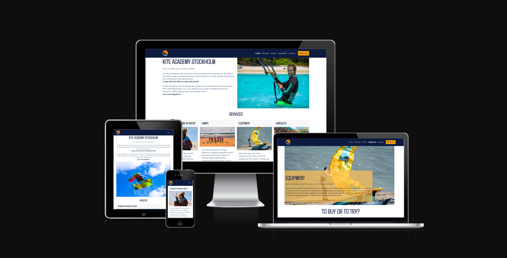
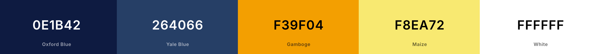
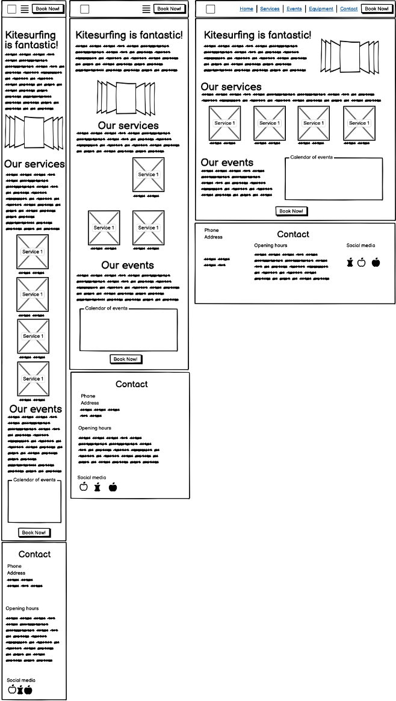
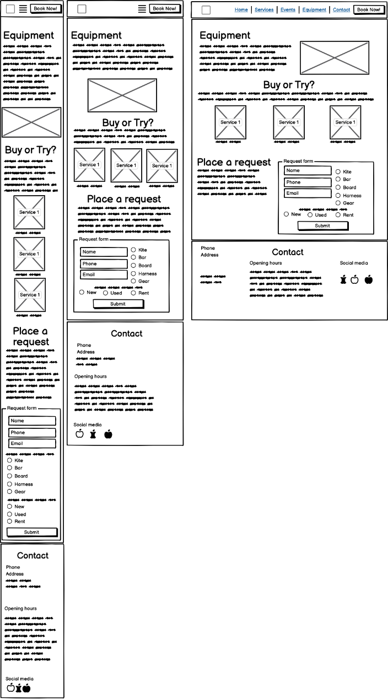
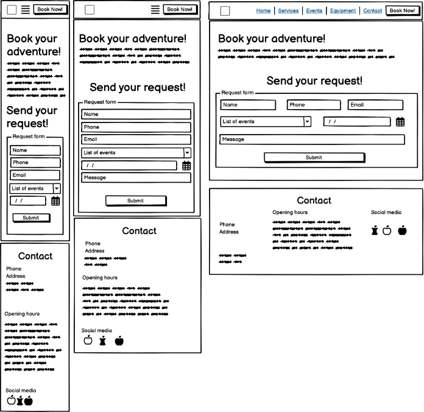
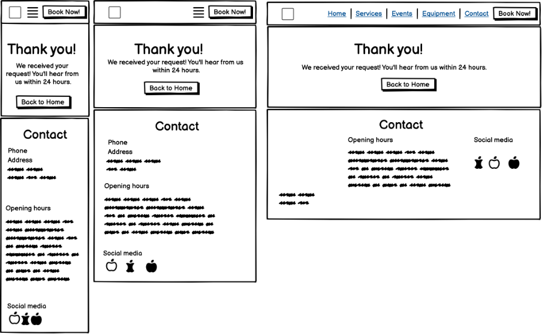
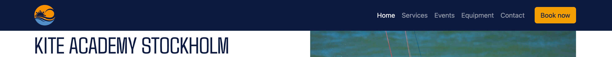
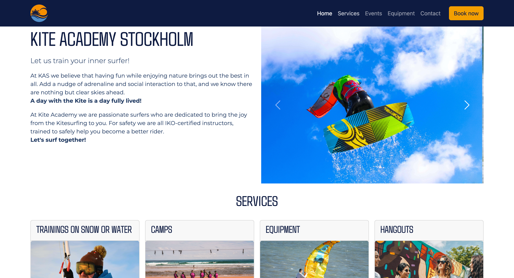
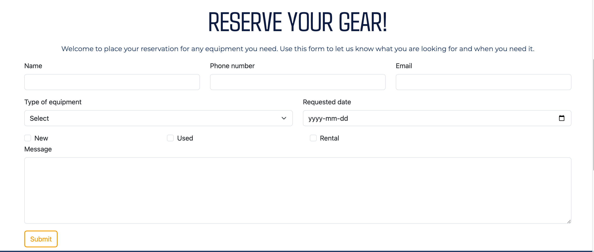
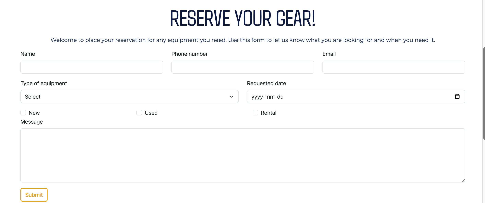

# Kite Academy Stockholm
Kite Academy Stockholm is a website that aims to attract the attention of potential as well as already committed kitesurfers. The site is a display window for an organization specialising in teaching kite surfing to all interested. The content is focused around services offered to visitors with a clear call to action to sign up for one of the services offered by the academy.

The main page states the purpose and beliefs of the Academy as an introduction, while displaying a set of inspiring images showing kite-surfing on water and on snow. The main page displays information about the range of services offered, the events planned. 

The main page leads over to a second page focusing the equipment needed for kitesurfing. This page highlights how the Academy supports surfers in selecting and eventually acquiring their own equipment. Intersted parties can use a dedicated form to place an inquiry for assistance.

You can access the deployed webpage here [Kite Academy Stockholm](https://jnicolin.github.io/MS1-KiteAcademy/).

# Table of Contents
- [Site Owner Goals](#Site)
- [User stories](#User)
- [Design](#design)
- [Features](#features)
- [Technology used](#Technology)
- [Validation and Testing](#Validation)
- [Deployment](#deployment)
- [Credits](#Credits)
- [Acknowledgments](#Acknowledgements)

# Site owner goals
- To promote and inspire about the practice of Kitesurfing in general
- To promote the services offered by the Academy to Kitesurfers around Stockholm in particular
- To attract new users to the website, that ultimately end up becoming an active client or member of the Academy community
- To promote the Academy professionalism toward suppliers and other professionals in the domain of Kitesurfing
- To promote the Academy professionalism for potential partnerships with winter or summer resorts 

# User stories
## As a Kitesurfer, I want to 
- learn more about the Kitesurfing Academy scope and procedures
- find information about how to learn or improve on Kitesuring practices
- find information about kite equipment
- be informed about events organized by the Academy
- find information aboout how to contact the Academy and how to enroll in actvities
## As a Trainer associated with the Academy, I want to
-  know who has enrolled to events 
-  know what level of experience enrolled students have
-  know if there are any particular circumstances or requests placed by the students 

## As an Administrators engaged with the Academy, I want to
-  capture addresses and personal details about those enrolling, to target them with correct information and invoicing
-  capture consent to engage in further communication, promoting loyalty
  
# Design
## Images
The images used on the site are chosen to promote the values communicated in text by Kite Academy Stockholm, which are typically "Fun", "Joy", "Nature".

Further the images are chosen to convey the idea that Kitesurfing is for everyone, that it can be mastered and that it is a social and inclusive sport that encourages the cooperation with other surfers. 

Finally, being based in Scandinavia, the summer period is not very long, why the Academy is active with training on snow during winter time, which is an important differentiator for this Academy, and promoted by the images

## Fonts
There are two fonts used in the website. Both quite simplistic and clean, quite natural and straight-forward. As is Kitesurfing. Modern, fast and clean.

## Colors 
The color scheme is based on shades of Blue, Orange and White. 

- Blue is associated with the sea.
- Orange with the Sun and energy.
- White is for cleanliness, distinction and snow. 

The choice of blue and orange, along with red, is very much used in the Kitesurfing domain on the Web.

## Wireframes, design ideas
All design ideas were scetched out on three different screen sizes to allow for early stage decisions on what works well on small to larger screens. 

### Main page
The landing page design is based on visual impressions from nice kite-related photos, complemented with nice descriptions of services. 

### Focus page, Equipment 
Kite-surfing is a materials sport, why the equipment deserves some extra attention. This page is designed to present Kite Academy as a strong partner in getting the right gear. 

During development it was decided to deviate some from the design idea, to add a hero-image on top with overlaying text, for a more engaging impression.

### Form page, Call to action
A form that opens once a CTA-button has been clicked. Allowing visitors to sign up for services offered by the Academy.

### Success page, acknowledgements
A page that pops-up once one of the two forms have been submitted. 

# Features
## Navbar features re-used across all site

The navigation bar is common to all pages for recognition. It is a collapsable navbar that stretches out on larger screens, to become a burger-icon at the breakpoint. 

The Navbar contains the dedicated Logo designed for the Academy. Further, the navbar holds a CTA-button in distinct color to stand out. 

## Main page conveying message of Services

The main page top has the heading of the Academy to make it clear what site a visitor has landed on, followed by a line stating the main mission of the Academy - "training". The top holds a declaration of what Kite Academy Stockholm values and beliefs.  

## Services section with clear Call To Action

The content of the main page is dedicated to the services offered by the Academy. They are presented via clean cards with a crisp header, a motivating illustration and the price. 

## Equipment reservation form embedded in the second page 

The equipemt page holds a form allowing for requesting access to gear or guidance on gear. It holds mandatory fields for collecting user identfication and addresses. 

# Validation and testing
## Manual testing
Clicking through the site gave some first findings. 
-	Automatic closure of the collapsed menu was not working. Added the JS-script provided by CI.

### Forms testing
There are two forms that were manually tested with the following test-cases: 
- Submit is not possible with any mandatory field left empty.
- Each field accepts only the intended type of input: text, numbers, email etc. 

Result: All testcases passed OK!

### Links testing
There are links on all pages, in the navbar and in buttons Test-cases
- Links leading to correct target
- Hover-effect correct on buttons 

Result 
-	the button on the index-page was leading to the top of the index-page rather than to the booking form.
- There was an absolute link in the URL to the Hero-section background-image. No image was displayed at first deploy.  

No remaining bugs. All testcases passed OK!

### Testing for responsiveness
Cross-browser testing was done to validate the responsiveness of the website accross different screensizes and positions. Tools like Chrome Inspect and the dedicated Responsinator.com were used. 

Testing for responsiveness passed OK!

## Automated testing
The Kite Academy site is tested using Chrome Lighthouse for Good practices, Performance and Accessibility.

Accessibility score of 76% comes from warnings on 3:rd party cookies associated with the Google maps iFrame. Excluding these gives a result of 100%.

## Validator testing
### HTML validation
- No bugs remaining at validation.  

### CSS validation
- No bugs remaining at validation. 

## Browser testing
The site was tested on the following browsers
- Chrome
- Safari
- Duck duck Go

## Device testing
## Fixed bugs
HTML-related
- A number of open "div", "li" tags left in the code.
- instances of unrelated “/” signs.
- Not allowed signs in the naming of image files, eg the spacebar-signs “ “. 
- Not allowed arguments in the iframe for sizing an embedded frame with Google maps. "Height" and "Width" moved to CSS-file.

### Notable bugs and fixes
-	Visual sizing and positioning of images with varying orignal size and layout. Use of relative measures rather than fixed values worked well. 
-	Many iterations on trimming of paddings and margins to get harmony across all screen sizes. 
-	Some mistakes from copy/paste when reusing code between html-files. Notably reusing Navbar, Footer and custom Button elements.

## Known bugs
Sizing of images in the carousel is not 100% identical accross devices. There is a slight variance in photos when reaching breakpoint Medium. 

# Technology used
## Languages
- HTML5
- CSS3

## Frameworks - Libraries - Programs used
- GitHub - code repository
- GitPod - integrated development environment
- GitPages - hosting environment for the deployed site
- Bootstrap - CSS-library simplifying responsive design
- Balsammiq - creating the wireframes
- Chrome Inspect - analysing output during development
- Fontawesome.com - importing icons
- Google fonts - importing fonts
- Colorhexa.com - selecting a colorscheme
- Colorpicker.com - selecting a color from an image
- Canva - creating the Logo
- TinyPng - compressing images
- Chrome Lighthouse - in testing
- Responsinator - in testing on screen sizes
- W3Org CSS- and HTML-validators

# Deployment
The Kite Academy site was deployed to GitPage from GitHub. Follow this sequence to deploy the site after changes to the code:

1. Select the Kite Academy repository in GitHub
2. Click on "Settings" on the upper right hand side
3. Under "Default Branch" - set the value to "main"
4. Save the settings. Deployment is now initated.
5. Press "Code" symbol to return to the main page
6. Look for "Deployments" on the right hand bar. 
7. The last deployment shall be indicated as ongoing or done.

The deployed site is available via this [Link](https://jnicolin.github.io/MS1-KiteAcademy/index.html)

# Credits
## Media
[Unsplash for photos](https://unsplash.com/)
- Gerald Schömbs
- Matt Bensom
- Dick Hoogerdijk
- Kelsey Chance

[Openart AI for generating images](https://openart.ai)
- Two of the photos under section "Services" of the main page were AI-generated using Openart AI's prompting.
1. Trainings
2. Equipment

## Resources used
- W3Schools for inspiration and examples on CSS and HTML
- Bootstrap site for inspiraton and examples
- Code Insitute for Java Script and Inspiration via examples

# Acknowledgements
My mentor Antonio for being available, professional and supportive.

The Code institute Slack community for being quick in replies and support. 

