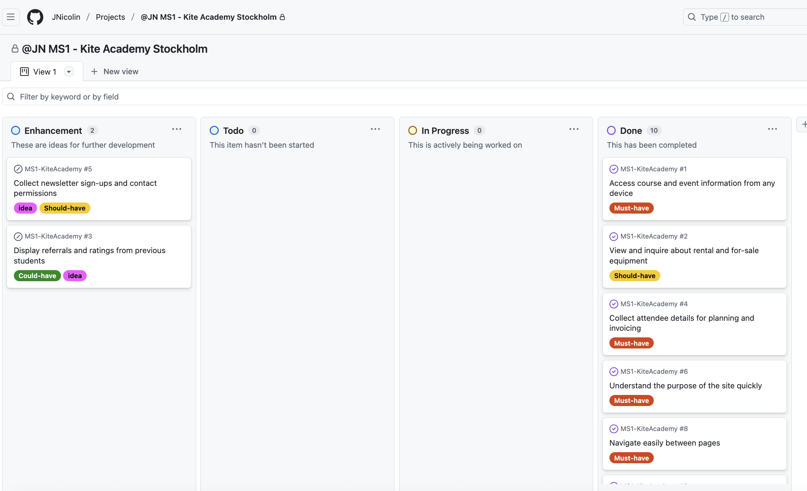

# Kite Academy Stockholm
Kite Academy Stockholm is a website that aims to attract the attention of potential as well as already committed kitesurfers. The site is a display window for an organization specialising in teaching kite surfing to all interested. The content is focused around services offered to visitors with a clear call to action to sign up for one of the services offered by the academy.

The main page states the purpose and beliefs of the Academy as an introduction, while displaying a set of inspiring images showing kite-surfing on water and on snow. The main page displays information about the range of services offered, the events planned. 

The main page leads over to a second page focusing the equipment needed for kitesurfing. This page highlights how the Academy supports surfers in selecting and eventually acquiring their own equipment. Intersted parties can use a dedicated form to place an inquiry for assistance.

You can access the deployed webpage here [Kite Academy Stockholm](https://jnicolin.github.io/MS1-KiteAcademy/).

# Table of Contents
- [Site owner goals](#Site)
- [User goals](#User)
- [Design](#Design)
- [Features](#Features)
- [Technology used](#Technology)
- [Agile project planning](#Agile)
- [Validation and Testing](#Validation)
- [Deployment](#Deployment)
- [Credits](#Credits)
- [Acknowledgments](#Acknowledgements)

# Site owner goals
- Inspire interest in kitesurfing by showcasing the joy, accessibility, and adventure of the sport to a broad audience through compelling visuals and engaging content.
- Promote the Academy’s services — including lessons, camps, and gear rentals — specifically targeting the active and growing kitesurfing community in the Stockholm region.
- Attract new visitors through clear course information, testimonials, and easy sign-up processes, converting them into active clients and community members.
- Demonstrate professionalism to equipment suppliers and industry professionals by highlighting client referrals, and structured training offerings.

# User goals
- Learn about kitesurfing — Discover what the sport involves, how to get started, and what training options exist, in a beginner-friendly and visually inspiring way.
- Find suitable lessons and events — Easily browse available training sessions, surf camps, and events that match their level and interests, with clear guidance on how to enroll.
- Get in touch with the Academy — Quickly submit questions or requests through intuitive forms, whether for bookings, rentals, or general inquiries.
- Explore equipment options — Understand what gear is available for rent or purchase, and request the right equipment for their skill level and preferences.
- Evaluate the Academy’s credibility — Read testimonials, see instructor profiles, and view images from real training sessions to build confidence before committing.
- Access the site on any device — Enjoy a responsive, mobile-friendly experience that allows them to explore and interact with the site wherever they are.
- Sign up for news and offers — Subscribe to newsletters and opt in for further contact to stay updated on future events, opportunities, and exclusive content.

# Design
## Images
The images used on the site are chosen to promote the values communicated in text by Kite Academy Stockholm, which are typically "Fun", "Joy", "Nature".

Further the images are chosen to convey the idea that Kitesurfing is for everyone, that it can be mastered and that it is a social and inclusive sport that encourages the cooperation with other surfers. 

Finally, being based in Scandinavia, the summer period is not very long, why the Academy is active with training on snow during winter time, which is an important differentiator for this Academy, and promoted by the images

## Fonts
There are two fonts used in the website. Both quite simplistic and clean, quite natural and straight-forward. As is Kitesurfing. Modern, fast and clean.

## Colors 
The color scheme is based on shades of Blue, Orange and White. 

- Blue is associated with the sea.
- Orange with the Sun and energy.
- White is for cleanliness, distinction and snow. 

The choice of blue and orange, along with red, is very much used in the Kitesurfing domain on the Web.

## Wireframes, design ideas
All design ideas were scetched out on three different screen sizes to allow for early stage decisions on what works well on small to larger screens. 

### Main page
The landing page design is based on visual impressions from nice kite-related photos, complemented with nice descriptions of services. 

### Focus page, Equipment 
Kite-surfing is a materials sport, why the equipment deserves some extra attention. This page is designed to present Kite Academy as a strong partner in getting the right gear. 

During development it was decided to deviate some from the design idea, to add a hero-image on top with overlaying text, for a more engaging impression.

### Form page, Call to action
A form that opens once a CTA-button has been clicked. Allowing visitors to sign up for services offered by the Academy.

### Success page, acknowledgements
A page that pops-up once one of the two forms have been submitted. 

# Features
## Navbar features re-used across all site

The navigation bar is common to all pages for recognition. It is a collapsable navbar that stretches out on larger screens, to become a burger-icon at the breakpoint. 

The Navbar contains the dedicated Logo designed for the Academy. Further, the navbar holds a CTA-button in distinct color to stand out. 

## Main page conveying message of Services

The main page top has the heading of the Academy to make it clear what site a visitor has landed on, followed by a line stating the main mission of the Academy - "training". The top holds a declaration of what Kite Academy Stockholm values and beliefs.  

## Services section with clear Call To Action

The content of the main page is dedicated to the services offered by the Academy. They are presented via clean cards with a crisp header, a motivating illustration and the price. 

## Equipment reservation form embedded in the second page 

The equipemt page holds a form allowing for requesting access to gear or guidance on gear. It holds mandatory fields for collecting user identfication and addresses. 

# Agile methodology
## Project planning based on Epics and User stories
### Epic 1: User orientation and navigation
- US1 [Understand the purpose of the site quickly](https://github.com/JNicolin/MS1-KiteAcademy/issues/6)
- US2 [Navigate easily between pages](https://github.com/JNicolin/MS1-KiteAcademy/issues/8)
- US3 [Access external links for social media](https://github.com/JNicolin/MS1-KiteAcademy/issues/12)
 
### Epic 2: Accessibility and content
- US4 [Access course and event information from any device](https://github.com/JNicolin/MS1-KiteAcademy/issues/1)
- US5 [View and inquire about rental and for-sale equipment](https://github.com/JNicolin/MS1-KiteAcademy/issues/2)
- US6 [Mobile accessibility](https://github.com/JNicolin/MS1-KiteAcademy/issues/10)
- US7 [Learn about lesson types](https://github.com/JNicolin/MS1-KiteAcademy/issues/11)
- US8 [See services, lessons and equipment](https://github.com/JNicolin/MS1-KiteAcademy/issues/7)

### Epic 3: Communication and conversion
- US9 [Collect attendee details for planning and invoicing](https://github.com/JNicolin/MS1-KiteAcademy/issues/4)
- US10 [Submit a contact form](https://github.com/JNicolin/MS1-KiteAcademy/issues/9)

## Kanban board to track progress
The progress of the project is tracked using a Kanban board. Progress can be followed [on this link](https://github.com/users/JNicolin/projects/4/views/1).

# Validation and testing
## Functional testing
### Functional test cases

| #  | Feature                         | Expected                         | Method               | Outcome                    | Status | User Story |
|----|----------------------------------|----------------------------------|------------------------|-----------------------------|--------|------------|
| 1  | Homepage content                | Show intro and call-to-action    | Visit homepage        | Content displayed           | Pass   | [US1](https://github.com/JNicolin/MS1-KiteAcademy/issues/6) |
| 2  | Navigation: Home link           | Go to homepage                   | Click "Home"          | Page loaded                 | Pass   | [US2](https://github.com/JNicolin/MS1-KiteAcademy/issues/8) |
| 3  | Navigation: Services link       | Go to Services section           | Click "Service"       | Section displayed           | Pass   | [US2](https://github.com/JNicolin/MS1-KiteAcademy/issues/8) |
| 4  | Navigation: Events link         | Go to Events section             | Click "Events"        | Section visible             | Pass   | [US2](https://github.com/JNicolin/MS1-KiteAcademy/issues/8) |
| 5  | Navigation: Equipment link      | Go to Equipments page            | Click "Equipment"     | Page loaded                 | Pass   | [US2](https://github.com/JNicolin/MS1-KiteAcademy/issues/8) |
| 6  | External social links           | Open in new tab, correct target  | Click icons           | Broken/missing href         | Fail   | [US3](https://github.com/JNicolin/MS1-KiteAcademy/issues/12) |
| 7  | Footer content and icons        | Show contact info + social icons | Scroll to footer      | Icons shown, not linked     | Fail   | [US3](https://github.com/JNicolin/MS1-KiteAcademy/issues/12) |
| 8  | Logo navigation                 | Click logo → homepage            | Click logo            | Redirect successful         | Pass   | [US2](https://github.com/JNicolin/MS1-KiteAcademy/issues/8) |
| 9  | 404 error handling              | Show fallback error page         | Invalid URL           | GitHub 404 page             | Pass   | [US2](https://github.com/JNicolin/MS1-KiteAcademy/issues/8) |
|10  | Mobile layout                   | Site adapts to small screens     | Resize / Responsinator| Layout responsive           | Pass   | [US6](https://github.com/JNicolin/MS1-KiteAcademy/issues/10) |
|11  | Performance: Load speed         | Fast initial load                | Load site             | Site loads quickly          | Pass   | [US6](https://github.com/JNicolin/MS1-KiteAcademy/issues/10) |
|12  | HTML heading structure          | Use semantic heading tags        | Inspect DOM           | Logical order confirmed     | Pass   | [US1](https://github.com/JNicolin/MS1-KiteAcademy/issues/6) |
|13  | Lesson descriptions             | Training info shown              | View services section | Content correct             | Pass   | [US7](https://github.com/JNicolin/MS1-KiteAcademy/issues/11) |
|14  | Services presentation           | Show cards, info, and image      | View services cards   | Cards visible               | Pass   | [US8](https://github.com/JNicolin/MS1-KiteAcademy/issues/7) |
|15  | Equipment overview              | List rental/sales equipment      | View equipment page   | Gear listed properly        | Pass   | [US5](https://github.com/JNicolin/MS1-KiteAcademy/issues/2) |
|16  | Course/event overview           | Display offering summary         | View homepage/events  | Info visible                | Pass   | [US4](https://github.com/JNicolin/MS1-KiteAcademy/issues/1) |
|17  | Forms on mobile                 | Forms usable on small screens    | Submit via phone      | Layout responsive           | Pass   | [US6](https://github.com/JNicolin/MS1-KiteAcademy/issues/10) |
|18  | Contact form submission         | Accept valid data, confirm       | Fill and submit       | No confirmation             | Fail   | [US10](https://github.com/JNicolin/MS1-KiteAcademy/issues/9) |
|19  | Contact form validation         | Block submit if fields empty     | Submit empty form     | No warning shown            | Fail   | [US10](https://github.com/JNicolin/MS1-KiteAcademy/issues/9) |
|20  | Field-level validation          | Enforce correct data types       | Enter invalid inputs  | Validation successful       | Pass   | [US10](https://github.com/JNicolin/MS1-KiteAcademy/issues/9) |
|21  | Reservation form fields         | Collect name, phone, email       | Submit form           | Data captured               | Pass   | [US9](https://github.com/JNicolin/MS1-KiteAcademy/issues/4) |
|22  | Reservation confirmation        | Show message after submit        | Submit form           | Confirmation visible        | Pass   | [US9](https://github.com/JNicolin/MS1-KiteAcademy/issues/4) |
|23  | Hero section CTA button         | Navigate to booking or target    | Click CTA             | Linked to wrong place       | Fail   | [US2](https://github.com/JNicolin/MS1-KiteAcademy/issues/8) |
|24  | Hero image loading              | Display background image         | View hero section     | Fixed path error            | Pass   | [US2](https://github.com/JNicolin/MS1-KiteAcademy/issues/8) |
|25  | Surfing activity imagery        | Show inspiring action photos     | View courses/events   | Images shown                | Pass   | [US4](https://github.com/JNicolin/MS1-KiteAcademy/issues/1) |

### Functional testing outcome
The table indicates the outcome before corrections. 
- TC6 wrong link to Instagram
- TC7 missing links to social media
- TC18 no confirmation of a correct submit was shown
- TC19 validation of form failed as it accepted empty fields.
- TC23 the button on the index-page was leading to the top of the index-page rather than to the booking form.
- TC24 there was an absolute link in the URL to the Hero-section background-image. No image was displayed at first deploy.  

All errors listed have been fixed. No errors remain in the deployed version. All testcases now have passed OK.

## Testing for responsiveness
Cross-browser testing was done to validate the responsiveness of the website accross different screensizes and positions. Tools like Chrome Inspect and the dedicated Responsinator.com were used. 

Testing for responsiveness passed OK!

## Automated testing
The Kite Academy site is tested using Chrome Lighthouse for Good practices, Performance and Accessibility.

Accessibility score of 79% comes from warnings on 3:rd party cookies associated with the Google maps iFrame. Excluding these gives a result of 100%.

## Validator testing
### HTML validation
- No bugs remaining at validation.  

### CSS validation
- No bugs remaining at validation. 

## Browser testing
The site was tested on the following browsers
- Chrome
- Safari
- Duck duck Go

## Device testing
## Fixed bugs
HTML-related
- A number of open "div", "li" tags left in the code.
- instances of unrelated “/” signs.
- Not allowed signs in the naming of image files, eg the spacebar-signs “ “. 
- Not allowed arguments in the iframe for sizing an embedded frame with Google maps. "Height" and "Width" moved to CSS-file.

### Notable bugs and fixes
-	Visual sizing and positioning of images with varying orignal size and layout. Use of relative measures rather than fixed values worked well. 
-	Many iterations on trimming of paddings and margins to get harmony across all screen sizes. 
-	Some mistakes from copy/paste when reusing code between html-files. Notably reusing Navbar, Footer and custom Button elements.
-   Maintaining the correct aspect ratio was somewhat tricky to a start. 

## Known bugs
There are no known remaining bugs. 

# Technology used
## Languages
- HTML
- CSS

## Frameworks - Libraries - Programs used
- GitHub - code repository
- GitPod - integrated development environment
- GitPages - hosting environment for the deployed site
- Bootstrap - CSS-library simplifying responsive design
- Balsammiq - creating the wireframes
- Chrome Inspect - analysing output during development
- Fontawesome.com - importing icons
- Google fonts - importing fonts
- Colorhexa.com - selecting a colorscheme
- Colorpicker.com - selecting a color from an image
- Canva - creating the Logo
- TinyPng - compressing images
- Chrome Lighthouse - in testing
- Responsinator - in testing on screen sizes
- W3Org CSS- and HTML-validators

# Deployment
The Kite Academy site was deployed to GitPage from GitHub. Follow this sequence to deploy the site after changes to the code:

1. Select the Kite Academy repository in GitHub
2. Click on "Settings" on the upper right hand side
3. Under "Default Branch" - set the value to "main"
4. Save the settings. Deployment is now initated.
5. Press "Code" symbol to return to the main page
6. Look for "Deployments" on the right hand bar. 
7. The last deployment shall be indicated as ongoing or done.

The deployed site is available via this [Link](https://jnicolin.github.io/MS1-KiteAcademy/index.html)

# Credits
## Media
[Unsplash for photos](https://unsplash.com/)
- Gerald Schömbs
- Matt Bensom
- Dick Hoogerdijk
- Kelsey Chance

[Openart AI for generating images](https://openart.ai)
- Two of the photos under section "Services" of the main page were AI-generated using Openart AI's prompting.
1. Trainings
2. Equipment

## Resources used
- W3Schools for inspiration and examples on CSS and HTML
- Bootstrap site for inspiraton and examples
- Code Insitute for Java Script and Inspiration via examples

# Acknowledgements
My mentor Antonio for being available, professional and supportive.

The Code institute Slack community for being quick in replies and support. 

